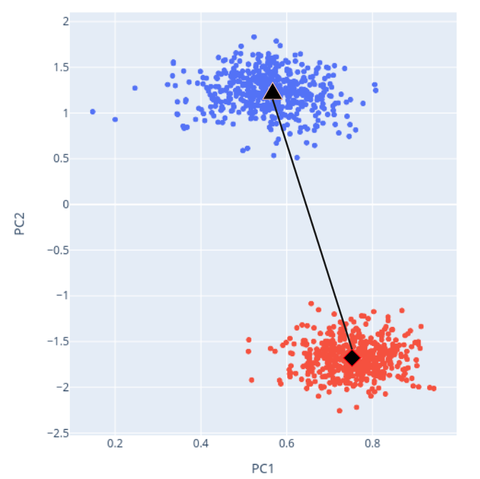
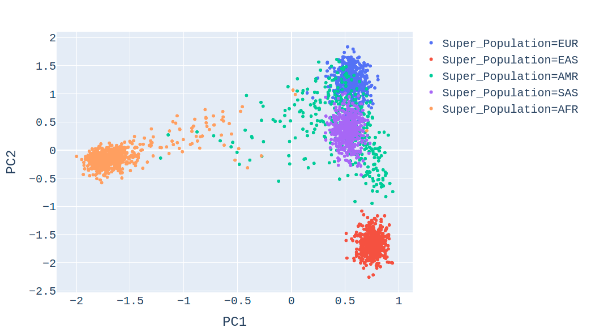
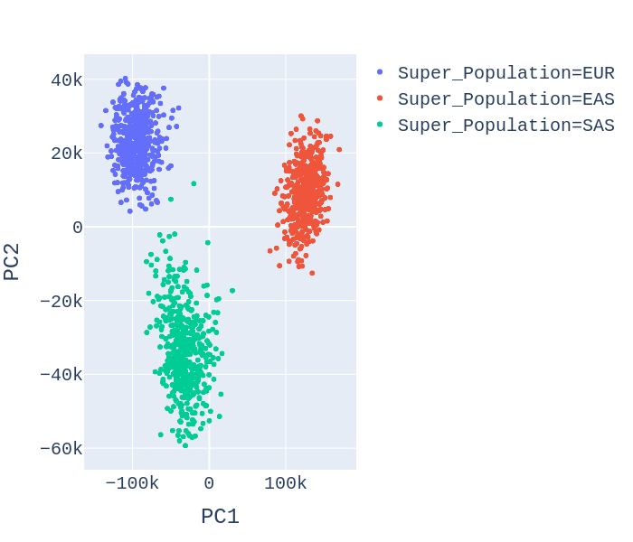
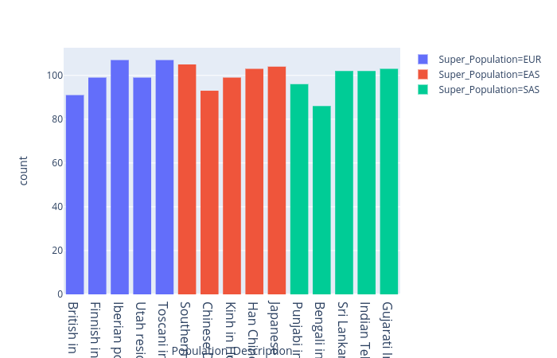
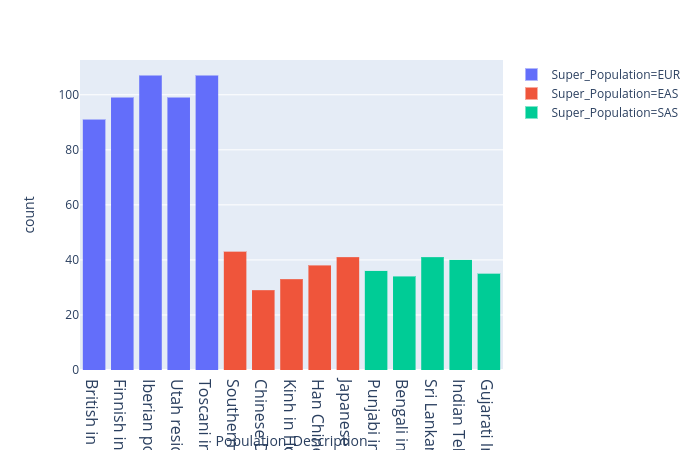
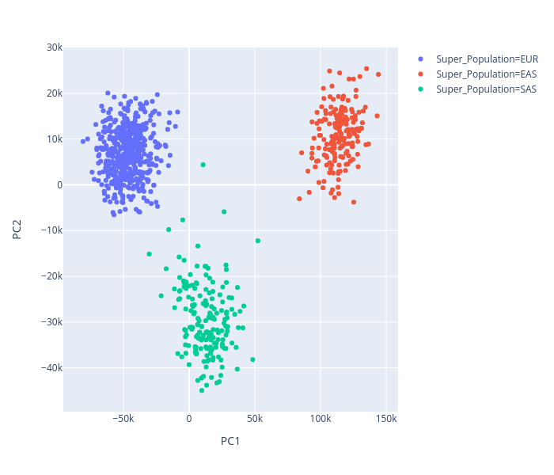
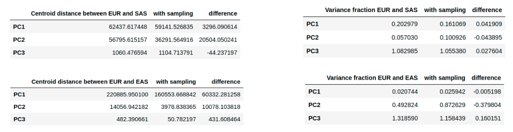

<!-- This is how to write a comment that won't be rendered-->

```{r knitr, echo=FALSE}
knitr::opts_chunk$set(
  eval      = FALSE,
  comment   = "#",
  results   = "hold",
  message = FALSE,
  warning = FALSE,
  collapse  = TRUE,
  fig.align = "center")
```

# Motivation

<p style="font-size:16pt">
    Our project explores the overarching theme of how sampling bias alters what we’re able to learn from our data.
</p>

### Datasets used
Chris studied a global sample of human genomes from the 1000 Genomes Consortium [@Thousand2015]. This data set contains genotype matrices for 88 million single nucleotide polymorphisms (SNPs) for 2504 individuals from 26 populations. 

Edward worked in the Hospitalist Project [@Hospitalist2017] dataset, which is a longitudinal dataset comprised of 22 years of observations on approximately 170,000 inpatient admissions to the University of Chicago Hospital General Medicine service. Every observation represents a unique patient visit, and comprises approximately 2000 variables that describe a patient’s demographic data, treatment data, and voluntary survey response data concerning the elements of their hospitalization. Of the available data, Edward worked on data from 2013 to 2019 (Present day), about 60,000 of the available observations. 

### Questions of interest 
For the 1000 Genomes data, Chris asks: **How does sampling bias affect the interpretation of genetic principal component analysis (PCA)?** Previous work [@McVean2009] has shown that uneven sampling distorts PCA projection. Using a simulated environment of 9 discrete sub-populations connected by migration, changing the distribution of individuals represented in PCA skewed the perceived differences between populations. By sampling from the 1000 Genomes data to alter the representations of members of each population, we expect to observe distortions in distances between populations in PC space. Chris will quantify the changes in PC distance as a function of the sampling scheme. 

Edward asks: **Is there an inherent bias in the way that patients are sampled to be surveyed for the voluntary collection of patient data?** Surveys are administered by Research Assistants and Coordinators over the entire body of qualified admissions (General Medicine Patients), and theoretically represent a uniform distribution, where all patients have an equal likelihood of being interviewed. In reality, of the available population, only 15-90% of eligible patients are surveyed in any given week. Edward will examine whether certain factors such as age, gender, and length of stay have a significant impact on the probability of being surveyed. This impact will be quantified by the use of linear regression and additional methods involving generalized linear models. 


# Methods

## Method or models

### 1000 Genomes

#### PCA review
Suppose we have a data set consisting of $n$ observations of $m$ variables. To obtain our ideal principal components we do the following:

1. We create a covariance matrix $\Sigma$.
$$ 
\sum = 
\begin{align*}
\left[\begin{matrix}Var(X_1)& Cov(X_1,X_2)& ... & Cov(X_1,X_m) \\ ... & ... & ... & ... \\ Cov(X_m, X_1) & Cov(X_m, X_2) & ... & Var(X_m) \end{matrix} \right]
\end{align*}
$$
2. We diagonalize this symmetric matrix to obtain matrices of its eigenvectors $Q = [\hat{q}_1, \hat{q}_2,...,\hat{q}_m]$ and eigenvalues $diag(\Lambda) = [\lambda_1, \lambda_2,...,\lambda_m]$.
$$ 
\sum = Q\Lambda Q^T
$$
3. We choose the $k$ eigenvectors $\hat{q}_1, \hat{q}_2,...,\hat{q}_k$ that correspond to the largest $k$ ordered eigenvalues. The ratio of the chosen eigenvalues to the sum of the eigenvalues tells us how much of the variance in our data is captured by the chosen PCs.

4. We perform an orthogonal projection of our data set onto the space of the chosen principal components (eigenvectors).

5. We scratch our heads trying to interpret these PC projection plots.

#### Population genetics and PCA
[@Novembre2008] has shown that genotype data can be used to accurately infer geographic relationships between populations. With a sample of genomes from several populations across Europe, Principal Component Analysis (PCA) was utilized to recover a map of Europe. PCA has been applied to numerous genetic datasets since, capturing significant elements of population structure. PCA is a statistical tool used to drastically reduce the size of a multi-dimensional dataset while retaining covariance information. For genetic data, PCA is useful for transforming a matrix of $\approx 10^6$ single nucleotide polymorphisms (SNPs) (*variables*) and $2504$ individuals (*observations*) into a matrix of $2 - 3$ principal components with values for each individual. With just a handful of variables, we can make interpretable figures to analyze our data.

#### Computing cluster distances
We need a way to quantify the distortion of distances in PC space due to sampling. For this project, we compare two metrics:

1. Centroid-centroid distance

We compare distance between means of clusters. The line in the following image captures this: 

<center>
{width=50%}
</center>

2. Pairwise fractions of variance $F_{cp}$

We divide the within population variance by the between population variance. If $X$ and $Y$ are the genotype values for two population clusters.
    
$$F_{cp} = \frac{Var(X)}{Var(X,Y)}$$

### Hospitalist

#### Linear regression and GLMs
Linear regression and generalized linear models are statistical tools which are widely used throughout the sciences to quantify behavior and to describe how a dependent variable is impacted by a multitude of variables which explain the dependent variable’s behavior. In many cases, the data can either be approximated as a linear system or can be manipulated to form a linear system; in other cases where the behavior of the dependent variable in response to explanatory variables have non-normal error distributions, a generalized linear model may be more appropriate. 

$$ 
Y_0 = B_0 + B_1X_i + \epsilon_i
$$

Linear regression relies on the use of regressors, or explanatory variables, and the regressand, or dependent variable. A model is proposed, in which our hypothesis or theory tells us which factors may influence our dependent variable, and our regression is constructed. Linear regression relies on a set of prior assumptions: That the model is linear in the parameters, that there is mean independence, that there is no autocorrelation between the error terms, that the number of observations is greater than the number of model parameters, that the values of the observations are not all the same, that there are no huge outliers, and that there is conditional homoskedasticity. Satisfaction of these assumptions yields coefficient estimates of the parameters that are BLUE: unbiased, efficient, consistent, and computable. By unbiased, we mean that the expected value of our estimate is equal to the true value of the parameter. By efficient, we mean that we have the lowest possible variance estimation method. Finally, by consistent, we mean that we collapse around the true value as our observation quantity approaches infinity. 

Linear regression is appropriate for our data and questions because it offers a way to accurately describe the trends in the overall Hospitalist dataset, and get accurate and quantifiable predictors of how parameters which may introduce bias can do so. Due to the large sample of data used, we can get extremely precise predictors of parameter values and detect even very slight biases using linear regression. Thus, we can directly answer our question of whether there is an inherent bias in the way that patients are surveyed for collection of data, and also describe how significant that bias is.   

While linear regression is a good start to begin to describe some of our data, and can provide us with immediately and easily interpretable results, generalized linear models are the gold standard for the analyses that we wish to conduct because of the specific structures that can be found in our data. Generalized linear models are appropriate to fit the data when the dependent variable is non-continuous, and our dependent variable is binary. This means that our errors display heteroskedasticity, and while we can correct for that in a linear regression, we may prefer to fit our data using the logistic regression family of generalized linear models because we wish for our model estimates for the dependent variable to run strictly between 0 and 1, as a patient can either be asked for an interview or not, and the dependent variable fundamentally represents a probability to be interviewed, which places a restriction on the values that it can take. In terms of answering questions, GLM’s help me to answer many of the same questions that linear regressions do:  whether bias exists in survey activity, and what the extent of that bias is. 

## Data processing
### 1000 Genomes
We first accessed the [1000 Genomes Version 3 genotype data](ftp://ftp.1000genomes.ebi.ac.uk/vol1/ftp/release/20130502/) online, downloading the 1GB **.vcf** file for chromosome $21$. We chose only one chromosome to conserve storage space and limit hurdles with expensive computations. With the `Python` package [scikit-allel](https://scikit-allel.readthedocs.io/en/stable/index.html), we parsed the .vcf file. 
 
The .vcf contains the number of sites sequenced in the chromosome $M=1105538$, and $N=2504$ the number of people sequenced. The parsed object further delineates `REF`, a vector $M$ nucleotides long that records the most common allele at each site (i.e. the "reference" genotype). We also have `ALT`, an $M$ by $3$ matrix that records the possible alternate variants. Finally, we get `GT`, an $N$ by $M$ by $2$ matrix that records individual genotypes at each site with values coded between $0$ and $3$. $0$ codes for the reference allele at that site, while $1$-$3$ code for which alternate allele the individual has. 

To simplify our analysis, we recode our alternate alleles to $1$. We can now construct an $N$ by $M$ matrix that counts the number of alternate alleles that each person has at each site. Each individual is given a $0$ if they have two copies of the reference, $1$ if one site is non-reference, and $2$ if both are. This is what we run PCA on. Still, there are a couple of complications to be discussed.
 
The first complication we must consider is linkage disequilibrium. Some population genetic models assume independent segregation among SNPs, but linkage disequilibrium, the non-independent assortment of sites, is a driver of population genetic diversity in real data. PCA assumes independence among variables, so we perform a simple downsampling step to correct for SNP autocorrelation. For each genotype, we choose $1000$ segments of length $m/1000$ (where $m$ is the highest number less than $M$ that is divided by $1000$) plus one segment of length $r=M-m$. Then for each segment we sample uniformly with `numpy.random.choice()`, where each nucleotide in the segment has the same probability of being chosen, but only from the inner half of the segment (e.g. from the segments $1000$ base pairs long we sample from the interval $(250,750)$). This confirms we have a sequence of size $1001$ of independent SNPs. 
 
A second complication is that running PCA on our data will make the first PC unimportant, since it will simply be a measure of the distance from the overall mean value. As such we standardize the data, meaning if $X_{ij}$ is an element in our array, we define $Y_{ij}=\frac{X_{ij}-\mu}{\sigma}$, where $\mu$ and $\sigma$ are the mean and standard deviation of the genotype array respectively. In all the figures presented, we color the points based on the super population (Africa: AFR, America: AMR, East Asia: EAS, Europe: EUR or South Asia: SAS) of origin of the person sequenced, to analyze how the spatial structure of the people influenced the genetic data.

### Hospitalist
The hospitalist data was processed in Stata due to institutional requirements to comply with protected health information procedures. As such, the Stata code is provided for reference in the appendix, but as the actual data is not publicly available, we will describe our data processing procedures generally without specifically referencing code. 

Data was pulled from multiple real-time flows providing information about interview responses, patient demographics and encounters, and patient identification data. They were merged together into a single dataset using an identifier that is unique to every patient encounter. As such, if a patient visited general medicine on multiple occasions during the 2013-2019 period, they would be considered as multiple encounters.  

Historically, a small percentage of all Hospitalist data comes from non-UChicago sites. Sub-studies have also taken place outside of the general medicine setting. All of these observations were removed once the merged dataset was compiled. To further clean the data, 2 patients with missing gender and 2 patients missing a week of admission were removed. 28 extreme subject outliers by age were dropped; the hospitalist study typically only consents patients 18 or older, so all patients less than 15 and older than 105 were removed from our data  set. Lengths of stay were calculated for every encounter, and approximately 0.3% of observations were removed from the data set when lengths of stay were negative, implying recording error, or were longer than 50 days. 

Once cleaned, the data was manipulated to gain the variables needed to conduct our bias analyses. A dummy variable was constructed that indicated if we attempted to interview a patient; another dummy variable indicated if the patient consented to the interview given an attempt. Age group dummy variables were constructed by rounding subject ages to the nearest 10. As mentioned previously, subject lengths of stay were computed; the number of patients admitted to general medicine every week was computed as well. In total, approximately 50 variables were constructed or used from the dataset for our analysis. The attached stata code provides comprehensive inline documentation for how these variables are used, how they are categorized, and in many cases how they are constructed and their distributions. Please refer to the appendix. 

The constructed variables and information used for analysis was then imported into R. Minor relabeling of variables was conducted in R for data that did not properly transfer, and both linear regressions and generalized linear models were run on the data. Specifically, the effect of age, patient admissions in the week prior, patient gender, and length of hospital stay were investigated as potential sources of bias. Additionally, ggplot was used to generate visual representations of data trends and the shape of the biases we observed in our interviewing patterns. 


# Results

## 1000 Genomes
All code and data used to generate figures can be found at [this repo](https://github.com/chrisporras/1000Genomes-PCA).

#### Full PCA without downsampling
<center>
{width=50%}
</center>

#### PCA on 3 populations
We choose 3 super populations (EUR,SAS,EAS) that would hypothetically have a continuous population structure gradient between them to analyze the effects of downsampling.

<center>
{width=50%}
</center>

#### Histogram of 3 uniform populations 
<center>
{width=50%}
</center>

#### Histogram showing over-representation of EUR in sub-sample
<center>
{width=50%}
</center>


#### PCA of down-sampled populations
<center>
{width=50%}
</center>

#### Distance metrics comparing cluster distances 
<center>
{width=100%}
</center>

## Hospitalist
Substantial evidence of bias was found in the hospitalist dataset in terms of the way in which patients are sampled to be surveyed for the voluntary collection of patient data. Regressions were run using the binary attempted_interview as the regressand and subject age, gender, length of stay, and admissions in the prior week as regressors. Various proxies for age were explored, including a dummy variable for geriatric patients, using a dummy variable for every age group, and looking at years over the age of 65. 


Data suggested that gender had a minimal effect on if a patient was interviewed if at all. The size of the effect was less than 1.5% in all cases and insignificant in a large portion of the regressions that we ran. Additionally, while the length of stay of patients and the admissions in the prior week were very important in predicting whether a patient was ultimately offered an interview and the size of the effect was both statistically and clinical relevant, these results serve more as functions of regression completeness and attempts to minimize omitted variable bias as opposed to actionable insights, as there is obviously no way that we can influence how long patients stay in the hospital and the quantity of the admissions we receive in the month before.  


The most notable factor we explored in which bias was clearly demonstrated was age. We discovered that while age does not drastically affect whether or not a patient is interviewed when they are younger (approximately less than 65-70 years old), patient interview rates begin to drop off drastically for patients over 70 years old. Patients who are 80 years old are 12% less likely to be asked for an interview than their 20 year old counterparts, while those who are 100 years old are almost 30% less likely to be asked to interview. This is in spite of the fact that a large portion of older patients have a proxy who is able to consent to the interview on behalf of the patient.


Interestingly, although interview rate is biased against older patients, the shape of that bias remains remarkably consistent. Although we manage to ask to interview anywhere from 10 to 90% of qualified patients in general medicine in any given week, the shape of the curve does not change as the weekly interview rate increases or decreases. When we interview a larger portion of our patients, we interview a larger portion of all age groups uniformly. We same the same result when we look at how attempted interviews change with new admissions in prior weeks. 


Upon preliminary comparison of an unbiased sample of patient data that accurately represents the general medicine population to a biased sample of data that we generated from the data we collected, we discovered a difference of approximately 1.5 years between the mean age of the patients in the unbiased as opposed to the biased dataset. This difference seems to manifest itself as a statistically significant difference in real measures of patient health. For example, there is a 1% difference between the self reported general health levels of the biased and unibased samples; this difference is significant to the 5% level. Continuing research is needed to further identify and quantify the clinical consequences of our observed biases in data collection. 


# Summary

#### 1000 Genomes
We set out to quantify the effect of downsampling on genetic PCA. The sampling process captures the underrepresentation of members of non-European ancestry in genetic data sets. Our hypothesis essentially argued that sampling bias (missing representation) limits our ability to visualize genetic relatedness between populations. PC distortion implies that certain populations will be interpreted as more distinct from other populations, when in reality perhaps each population is identical [@McVean2009].

Our results show some perturbations in cluster distances by overrepresenting EUR compared to EAS and SAS in our sample. We have large positive differences in mean cluster distances indicating the pulling of clusters away from one another. We also observe some non-zero shifts in variance fraction, indicating distorted spread of the clusters relative to one another. Ultimately, these results show a possible distortion of clusters in PC space as a result of the sampling process. Still, the distortion is qualitatively unrecognizable in the plots themselves. 

Professor Allesina recommended testing populations of vastly different variances (EUR and AFR or AMR for example). In the future, Chris will continue to test these sampling effects and report his findings. Chris will also expand the distance metrics to include more common genetic variation measures, such as Wright's $F_{st}$ [@Wright1931].

#### Hospitalist
We learned a great deal about how to identify and quantify the bias that is present in data, and learned that there are many dimensions to consider to bias; not only should we ascertain whether or not the data is biased and quantify the bias if it exists, but we should also look at if the bias itself varies, either temporally or based on the behavior of other variables we can observe. 

Because the functional form of our bias remained highly consistent despite highly varying rates of new admissions and weekly overall attempted interview rates, overall impact on real world clinical data was not severely impacted, and more work has to be done to ascertain the extent to which our biased data distorts clinical findings. Currently, our work suggests that these biases are statistically significant but relatively minor in scale. However, this research has already pushed the Hospitalist project to move forward in addressing issues of selection bias, as we explore ways in which to better target and represent our elderly patient population. 

As this research continues, there are three primary directions in which we would like to take this investigation of bias. The first direction is to better quantify the effects of the bias on real clinical variables such as patients' perception of their general health. The second direction would be to investigate the hypothesis that elderly patients are interviewed less in part because of cognitive disability or similar sickness; while we cannot access the medical records of living patients whom we do not interview and thus do not know their medical status, we can perform a proxy study by identifying patients that entered our interview pool several years ago with a given medical condition, such as  dementia, and compare proportional statuses to patient death records, which are non-protected information. The third and final direction that we hope to take this research is to look into the economic drivers of the bias being introduced into the behavior of our interviews; quantifying the costs and incentives behind both interviewing and being interviewed, and attempting to identify specific staff that are particularly skilled and successful at interacting with the elderly.

# Acknowledgements

Chris would like to thank: 

- Novembre lab for motivating this analysis. 
- The Thousand Genome Project Consortium for data availability.
- Our awesome TA Julia Smith, Profs. Dmitry Kondrashov and Stefano Allesina for their support throughout this quarter.

Edward would like to thank: 

- The Meltzer lab for motivating this analysis and providing access to the Hospitalist Database for the purposes of this research. 
- Professor Meltzer, Methods Core Director Andrea Flores, and Hui Zhang for their feedback and guidance throughout the research process.
- Professors Dmitry Kondrashov and Stefano Allesina, as well as our TA Julia Smith for their support and teaching throughout this quarter.


# References

<!-- This will display references included in mybib.bib file -->
<div id="refs"></div>

# Appendix

#### 1000 Genomes PCA
 - All code and data used to generate figures can be found at [this repo](https://github.com/chrisporras/1000Genomes-PCA). 
     - Navigate to `sampling_PCA/notebooks/1000Genomes-PCA.ipynb` to find notebook used to process PCs. 
     - All PC computation is done on the cluster using the `add_gt_arr.py` script. 

- 1K Genomes data is available in variant call format at [this link](ftp://ftp.1000genomes.ebi.ac.uk/vol1/ftp/release/20130502/).

- Python package `scikit-allel` is recommended for parsing the 1K Genomes data. The package can be found [here](https://scikit-allel.readthedocs.io/en/stable/index.html).


#### Hospitalist
 - All code can be found at [this repo](https://github.com/drawdeuohz/Fundamentals-of-Biological-Data-Analysis)
 


